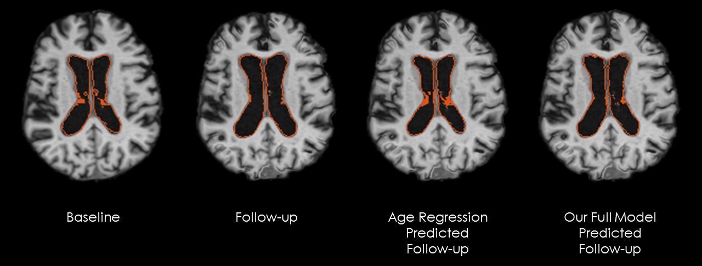
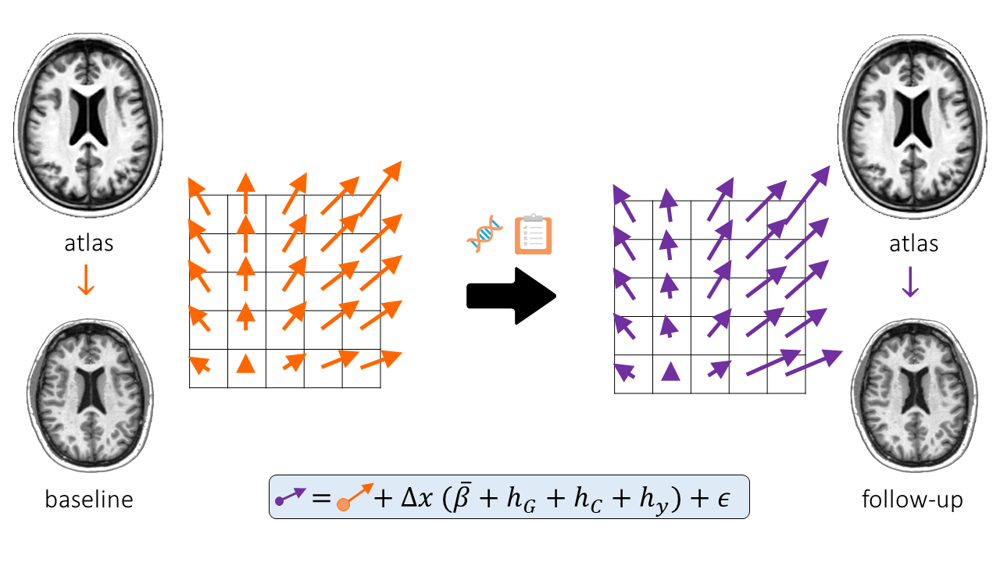

# voxelorb
Built on a generative model, the code enables predicting anatomy (a full MR volume) of a patient in subsequent scans following a single baseline image. 

# Learn more

## Video 

The concepts are best explained through concise [5-minute video](https://www.youtube.com/watch?v=r6E5bTl6X7o)!

## Paper
**Predictive Modeling of Anatomy with Genetic and Clinical Data**  
A.V. Dalca, R. Sridharan, M.R. Sabuncu, P. Golland.  
MICCAI: Medical Image Computing and Computer Assisted Intervention, LNCS 9351, pp. 519-526, 2015.  
[arXiv](https://arxiv.org/abs/2010.04757)
